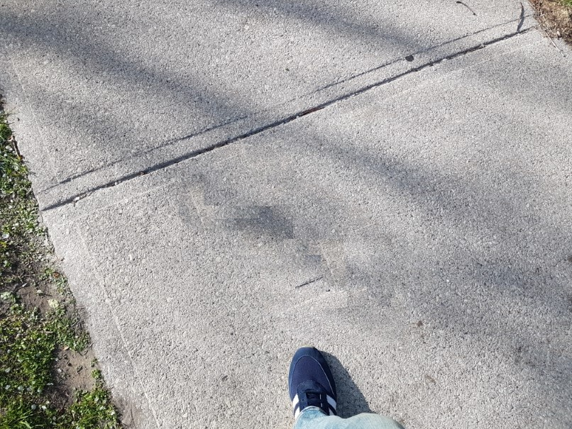

# Object removal experiments

Light-weight (and sort of hackish) replication of the algorithms described 
in the paper
[Object Removal by Exemplar-Based Inpainting](https://www.microsoft.com/en-us/research/wp-content/uploads/2016/02/criminisi_cvpr2003.pdf) 
by Criminisi, Perez and Toyama.

## Requirements

To install requirements:

```setup
pip install -r requirements.txt
```

## Usage

To run the algorithm:

```run
python runner.py
```

## Results

Results for input image 1:

Input Image            |  Output Image     |
:-------------------------:|:-------------------------:|
  |   |

Results for input image 2:

Input Image             |  Output Image    |
:-------------------------:|:-------------------------:|
  |   |

Results for input image 3:

Input Image             |  Output Image    |
:-------------------------:|:-------------------------:|
  |   |
